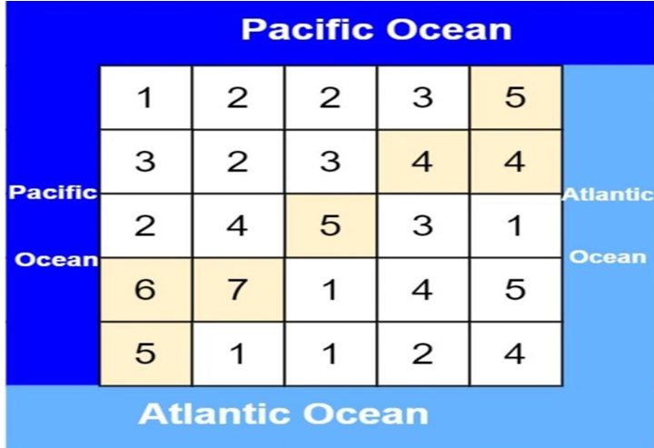

## A Code to solve the folowing problem : 
لدينا جزيرة مُستطيلة بحجم m x n يحدها المحيط الهادي والمحيط الأطلسي. يلامس المحيط الهادي حواف الجزيرة اليسرى والعلوية، بينما يلامس المحيط الأطلسي حواف الجزيرة اليمنى والسفلى.
تم تقسيم الجزيرة إلی شبكة من الخلایا المربعة. تهطل علی الجزیرة الکثیر من الأمطار، ویمکن لمیاہ الأمطار
أن تتدفق إلى الخلايا المجاورة شمالًا وجنوبًا وشرقًا وغربًا في حال كان ارتفاع الخلية المجاورة أقل من ارتفاع الخلية الحالية. ويمكن للماء أن يتدفق من أي خلية مجاورة للمحيط إلى المحيط.
اطبع مصفوفة "result" حيث "resulti = ri، ci" تدل على أن مياه الأمطار يمكن أن تتدفق من الخلية "(ri، ci)" إلى كل من المحيط الهادي والمحيط الأطلسي.

